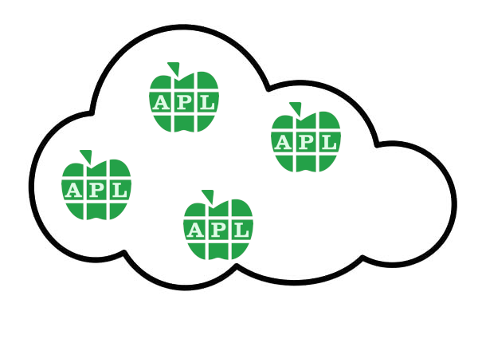

aplcloud
========

*Use a cloud platform for horizontal scaling of an APL computation*

Background
----------
An actuarial computation in APL+Win loops through a list of records. 
The loop is suitable for parallel processing: the iterations are entirely independent of each other.
Processing a list of records takes up to two hours in some cases.

Some progress has been made with hardware on customer premises, ‘fanning out’ computation across multiple machines or cores.
For this, the application delegates sublists of records to a Request Broker process (RB), which manages Worker processes.
The main application, RB, and Workers are implemented in APL+Win.
Interprocess communication was implemented first with OCX controls, later with HTTP.

The code in the Worker process requires no GUI and is a good candidate for porting.
APL+Win is a 32-bit Windows interpreter nearing its end of life.
Migration candidates are APL64 (64-bit Windows) and Dyalog APL (Linux, macOS, and Windows).
For this project, the OS remains Microsoft Windows.

A cloud implementation would permit the application owner to offer it as a service.

Cloud platform
--------------
Microsoft Azure is the cloud platform preferred by the application’s user with the largest workloads.
Amazon Web Services is the platform chosen by the application owner for developing future services.
An ideal deployment solution would use either platform with little variation. 

**Azure Functions** (AF) and **AWS Lambda** (AL) offer ‘serverless’ deployment suitable for occasional processing.
Both bill only for resources used in responding to requests; both manage ‘horizontal scaling’, i.e. distributing processing across hardware resources as needed. 
AF and AL are typically used for ‘microservices’: processes that perform a single task quickly, such as producing a thumbnail image from an image file. Their processes are limited to a few minutes.

**Azure Durable Functions** (ADF) extends AF to handle heavier workloads and is not subject to the same time limits as AF.
It distinguishes three kinds of function. 

<dl>
<dt>Client</dt>
<dd>High availability and low latency: receives incoming job, invokes the <em>Orchestration</em> function and returns a <em>Download URL</em> from which the result can be downloaded when ready. (Until then an HTTP GET will get a 202 response.)</dd>

<dt>Orchestration</dt>
<dd>
	Receives the incoming job from the Client, parcels it out to Worker functions (‘fan-out’), and restarts failed parcels.
	Combines the results from the Workers, and writes the final result to the Download URL.
</dd>

<dt>Worker</dt>
<dd>Receives a work ‘parcel’ from the Orchestration function, and returns to it the result.</dd>
</dl>

### Does Amazon Web Services offer an equivalent to Azure Durable Functions?
>ChatGPT: 
>As of my last knowledge update in January 2022, Amazon Web Services (AWS) does not have a direct equivalent to Azure Durable Functions. Azure Durable Functions is a serverless extension for Azure Functions that allows you to write stateful functions in a serverless environment.
>
>However, AWS provides various services and features that can be used to implement similar functionality. For example, AWS Step Functions is a cloud service that enables you to coordinate and sequence AWS services, including AWS Lambda functions, to build serverless applications. It allows you to define workflows and manage the flow of data between different AWS services.
>
>To achieve similar patterns as Azure Durable Functions on AWS, you might need to combine multiple services like AWS Lambda, Step Functions, and perhaps a storage service like Amazon DynamoDB or Amazon S3 for maintaining state.
>
>Keep in mind that the cloud service offerings are continually evolving, and AWS may introduce new features or services after my last update in January 2022. I recommend checking the official AWS documentation or contacting AWS support for the most up-to-date information on available services and features.

Proof of concept
----------------
Plan of work:

1.  Implement an AF using APL+Win

    The AF will receive an HTTP GET request including a string, and return a 200 response with the string reversed.

1.  Implement a synch AF using APL+Win to process a short list of records

    The AF will receive an HTTP POST request with a file (upload) and return a 200 response with the processed result as a single file.

1.  Implement an asynch AF using APL+Win to process a short list of records

    The AF will receive an HTTP POST with a single file and immediately return a Download URL. 
    It will write the Download URL and received file to Blob storage, triggering a second AF that will process the file and write the result to the Download URL. (Only the second AF requires APL.)

1.  Implement an asynch AF using Superval to process a short list of records

    As in the previous step, but the second AF will use Superval to process the file, 
    and the external HTTP GETs will be secured with function keys.

At this point we will have a cloud-based service API that could be used by the Superval application.

For example, if Superval parcels an evaluation into 100 API calls, it will assemble the evaluation results from 100 URLs produced by up to 100 worker processes. 
While Superval continues to manage the fan-out, the horizontal scaling is performed by Azure; Azure charges apply only while evaluation is in progress.

Upgrade to Azure Durable Functions:

-   Write a Client function to receive entire evaluation workload, push to Blob storage, return Download URL.
-   Write an Orchestration function to parcel out the workload to Worker functions, manage failover, assemble results and write to Download URL,
-   Write a Worker function to receive parcel, write files in local filesystem, call APL evaluation, and return output files to Orchestration function.

Progress
--------
- [x] Implement an AF using APL+Win
- [ ] Reimplement using Dyalog APL
- [ ] Implement a synch AF using APL+Win to process a short list of records
- [ ] Implement an asynch AF using APL+Win to process a short list of records
- [ ] Implement an asynch AF using Superval to process a short list of records
- [ ] Upgrade to Azure Durable Functions

Notes
-----

What worked, what didn't.

### 1. Implement an AF using APL+Win

Both AF and AL support code-only functions: if you write a function in a supported language (C#, Java, JavaScript, Powershell, Python or TypeScript for AF; C#, Go, Java, Node.js, Ruby, PowerShell or Python for AL) the platform will run the code. It also provides libraries so your function can access other platform services, such as AWS Simple Storage Solution (S3) or Azure Blob storage. 

#### Linux and Wine

Neither platform runs APL code or provides an APL library to access platform services. 
For functions implemented in unsupported languages, both platforms recommend defining the function as a Docker container.
This looks to be a dead end for APL+Win, but it took some work to establish that.

AF and AL both limit the use of containers to Linux containers.

It is possible to run APL+Win under Linux by installing the [Wine compatibility layer](https://www.winehq.org) which handles basic calls to the Windows OS. 
Proof of concept: ran APL+Win in a Linux Docker container on a Macintosh. 

#### A Docker container for AF or AL

The interface libraries for the cloud platforms are 64-bit code; 
Wine and APL+Win are both 32-bit code. 
The container image must therefore be constructed from a Linux distro with the multi-architecture extension; i.e. Debian, of which Ubuntu is a derivative: 
see [`phase0/Dockerfile`](./phase0/Dockerfile). 

The described container still lacks a supported language.
The intention was to install in it both Node and the platform interface library for it.
But first to demonstrate running an APL task headless, i.e. from the command line. 

This failed with error reports from Wine that indicated an attempt to use the GUI. 
Searching the Web for solutions found ways to configure the GUI for X11 but 
(a) they all related to gaming applications and 
(b) having a headless application depend on getting a GUI configuration right would be a worrying dependency.

#### Headless from Node

Back to studying Azure for a different solution: Azure because running under Windows would eliminate issues with Wine.

Followed Microsoft Learn tutorials and constructed an AF in Node that reverses a string. 

APL+Win has no way to read parameter values from the command line, so inputs must be from file.
AF instances have a local file system at `D:\home` with 500 MB storage.
So `MyHttpTrigger.js` writes the received string to `D:\home\input.txt`, makes an async call to `aplwr.exe reverser.w3` then reads `D:\home\output.txt` for the revered string to return. 

In the Azure portal, created a Function App `sjtfun1220` and within it a Function `MyHttpTrigger` with a Node runtime. 

On my local machine used [Azure Core Tools](https://learn.microsoft.com/en-us/azure/azure-functions/functions-run-local?tabs=macos%2Cisolated-process%2Cnode-v4%2Cpython-v2%2Chttp-trigger%2Ccontainer-apps&pivots=programming-language-csharp) to test `MyHttpTrigger` 

    func start

and then to publish to Azure

    func azure functionapp publish sjtfun1220

and in the local command shell

    ❯ curl https://sjtfun1220.azurewebsites.net/api/myhttptrigger\?name\=robert
    Hello from APL, trebor!

### 2. Reimplement using Dyalog

Script [`make-azure-funapp.ps1`](./phase2/make-azure-funapp.ps1) generates versions of AF in either APL+Win or Dyalog APL and sets up for publication to Azure.

#### Status 

- [x] [`revaplwin.azurewebsites.net/api/myhttptrigger?name=treboR`](https://revaplwin.azurewebsites.net/api/myhttptrigger?name=treboR) works
- [ ] [`revdyalog.azurewebsites.net/api/myhttptrigger?name=treboR`](https://revdyalog.azurewebsites.net/api/myhttptrigger?name=treboR) works on Azurite (localhost) but breaks on Azure

#### Azurite

    PS C:\Users\steph> curl http://localhost:7071/api/MyHttpTrigger?name=moT                                                

    StatusCode        : 200
    StatusDescription : OK
    Content           : Hello from Dyalog APL, Tom!
    RawContent        : HTTP/1.1 200 OK
                        Transfer-Encoding: chunked
                        Content-Type: text/plain;charset=UTF-8
                        Date: Fri, 29 Dec 2023 11:54:01 GMT
                        Server: Kestrel

                        Hello from Dyalog APL, Tom!
    Forms             : {}
    Headers           : {[Transfer-Encoding, chunked], [Content-Type, text/plain;charset=UTF-8], [Date, Fri, 29 Dec 2023
                        11:54:01 GMT], [Server, Kestrel]}
    Images            : {}
    InputFields       : {}
    Links             : {}
    ParsedHtml        : System.__ComObject
    RawContentLength  : 27

    PS C:\Users\steph>

#### Azure

    PS C:\Users\steph> curl https://revaplwin.azurewebsites.net/api/myhttptrigger?name=moT                                  

    StatusCode        : 200
    StatusDescription : OK
    Content           : Hello from APL+Win, Tom!
    RawContent        : HTTP/1.1 200 OK
                        Transfer-Encoding: chunked
                        Content-Type: text/plain;charset=UTF-8
                        Date: Fri, 29 Dec 2023 11:56:54 GMT

                        Hello from APL+Win, Tom!
    Forms             : {}
    Headers           : {[Transfer-Encoding, chunked], [Content-Type, text/plain;charset=UTF-8], [Date, Fri, 29 Dec 2023
                        11:56:54 GMT]}
    Images            : {}
    InputFields       : {}
    Links             : {}
    ParsedHtml        : System.__ComObject
    RawContentLength  : 24

    PS C:\Users\steph> curl https://revdyalog.azurewebsites.net/api/myhttptrigger?name=moT
    curl : The remote server returned an error: (500) Internal Server Error.
    At line:1 char:1
    + curl https://revdyalog.azurewebsites.net/api/myhttptrigger?name=moT
    + ~~~~~~~~~~~~~~~~~~~~~~~~~~~~~~~~~~~~~~~~~~~~~~~~~~~~~~~~~~~~~~~~~~~
        + CategoryInfo          : InvalidOperation: (System.Net.HttpWebRequest:HttpWebRequest) [Invoke-WebRequest], WebExc
       eption
        + FullyQualifiedErrorId : WebCmdletWebResponseException,Microsoft.PowerShell.Commands.InvokeWebRequestCommand

    PS C:\Users\steph>

#### Diagnostics

Since the `dyalogrt.exe reverser.dws` command succeeds on Azurite its failure on Azure must be due to differences in the environment.

    2023-12-29T07:49:01.262 [Information] Executing 'Functions.MyHttpTrigger' (Reason='This function was programmatically called via the host APIs.', Id=16592c1d-55a4-41e0-9683-93030dd960fd)
    2023-12-29T07:49:01.311 [Information] Http function processed request for url "https://revdyalog.azurewebsites.net/api/myhttptrigger?name=treboR"
    2023-12-29T07:49:01.475 [Error] Executed 'Functions.MyHttpTrigger' (Failed, Id=16592c1d-55a4-41e0-9683-93030dd960fd, Duration=213ms)Result: FailureException: Command failed: dyalogrt.exe reverser.dwsStack: Error: Command failed: dyalogrt.exe reverser.dwsat ChildProcess.exithandler (node:child_process:412:12)at ChildProcess.emit (node:events:513:28)at maybeClose (node:internal/child_process:1091:16)at ChildProcess._handle.onexit (node:internal/child_process:302:5)

> Hello, this is Bing. It seems like you are trying to run a Windows executable file (dyalogrt.exe) on a Linux container using Wine. According to the web search results¹²³, this may cause some compatibility issues and errors. Here are some possible solutions that you can try:
> 
> - Use the VCRedist installation method to install the Microsoft Universal C Runtime library (the UCRT) as part of your Dyalog run-time application². This requires Administrator privileges.
> - Use the App-local installation method to install the UCRT components into the same directory as your Dyalog run-time application². You can obtain these files from the Dyalog development package or the Windows 10 SDK².
> - Use a different version of Wine that supports the Dyalog run-time components². You can check the WineHQ website for more information⁴.
> - Use a different type of run-time application or component that is compatible with Linux, such as a Microsoft.NET Assembly².
> 
> I hope this helps you resolve your error. If you have any other questions, please feel free to ask. 😊
> 
> Source: Conversation with Bing, 29/12/2023
> (1) Using a Windows EXE for an AWS Lambda or Azure Functions runtime. https://stackoverflow.com/questions/77591912/using-a-windows-exe-for-an-aws-lambda-or-azure-functions-runtime.
> (2) Run-Time Applications and Components. https://help.dyalog.com/17.1/Content/UserGuide/Installation%20and%20Configuration/Runtime%20Applications%20and%20Components.htm.
> (3) Run-Time Applications and Components - Dyalog. https://help.dyalog.com/latest/Content/UserGuide/Installation%20and%20Configuration/Runtime%20Applications%20and%20Components.htm.
> (4) undefined. https://dl.winehq.org/wine-builds/winehq.key.
> (5) undefined. https://dl.winehq.org/wine-builds/ubuntu/dists/jammy/winehq-jammy.sources.
> (6) undefined. https://developer.microsoft.com/en-us/windows/downloads/windows-10-sdk.
> (7) undefined. https://blogs.msdn.microsoft.com/vcblog/2015/03/03/introducing-the-universal-crt.

Bing's first link is to my own StackOverflow question, unanswered and deleted by moderators.

Bing's comments suggest Wine is part of the Azure Functions technology.
That would be consistent with the console message about installing npm, seen when creating the AF locally.

The Dyalog runtime is here invoked using the [Workspace Runtime method](https://help.dyalog.com/17.1/Content/UserGuide/Installation%20and%20Configuration/Runtime%20Applications%20and%20Components.htm#Workspace_RunTime). 

> If your application uses any component of the Microsoft .NET Framework, you must distribute the Bridge DLL and DyalogNet DLLs. These DLLs must be placed in the same directory as your EXE.

Included in `phase2\revdyalog`:

    -a----        08/03/2022     14:23        2378240 bridge182-64_unicode.dll
    -a----        08/03/2022     14:22          86528 Dyalog.Net.Bridge.dll
    -a----        08/03/2022     14:22        1358848 Dyalog.Net.Bridge.Host.dll

but the song remains the same.

***

## Acknowledgements

My thanks for advice from Michael Hughes and Morten Kromberg.